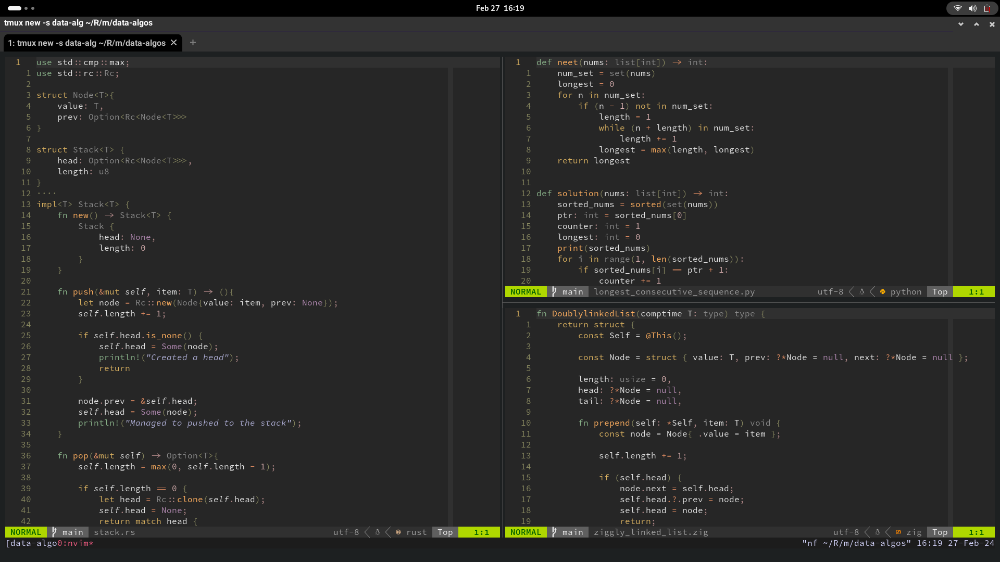

# Plamedi's dotfiles

## notes

To expedite new setups, I've created a setup.sh and dev\_env.sh
The setup should be run first. These do not assume a swaywm environment
and therefore do not setup for that.

Currently the setup assumes pacman as the package manager,
and will be adjusted in the future to include conditionals that check for the system package manager.

Besides that please read what is in the scripts first before running them, and decide for yourself what you want to keep or change.

Everything here is very experimental and hasn't been test driven yet so again, approach with caution.

## Setup

As you can see the aesthetics have been toned down, and we're stock gnome now.

Anyway goodluck and thank you.
