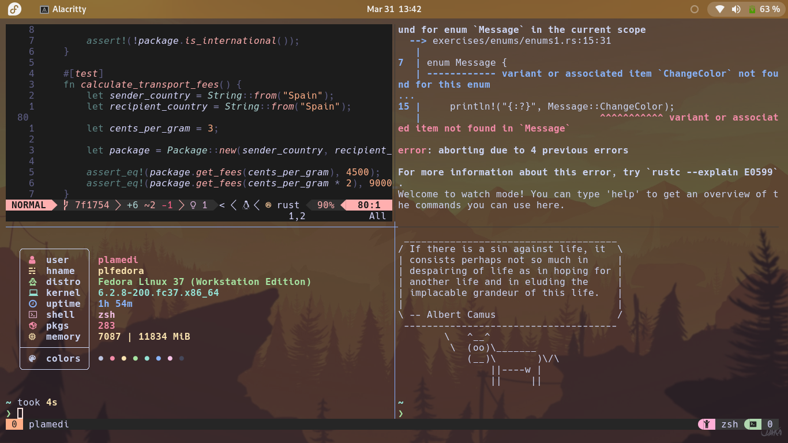

# Plamedi's dotfiles

## notes

- Before sourcing the .zshenv file, place the zsh folder into your $HOME/.config/ path. 

- For the terminals, I use [Hack Nerd Font Mono](https://www.nerdfonts.com/font-downloads).

- For tmux copy both the .tmux.conf file and .tmux folder to your $HOME root dir.
After, install the tmux package manager by running:

```bash
git clone https://github.com/tmux-plugins/tpm ~/.tmux/plugins/tpm
```

After that create a tmux session with `tmux` on the command line. Then press
the prefix key, `Ctrl`+`B` for default, followed by the Capital letter I. This
should bring up the package manager installer and the tmux status line should
change to the catppuccin theme.

- In case the above doesn't work, enter the following inside a tmux session:

```bash
tmux source-file ~/.tmux.conf
```

Then attempt the prefix capital I combo from before.

## Neovim 


## Tmux session in alacritty

