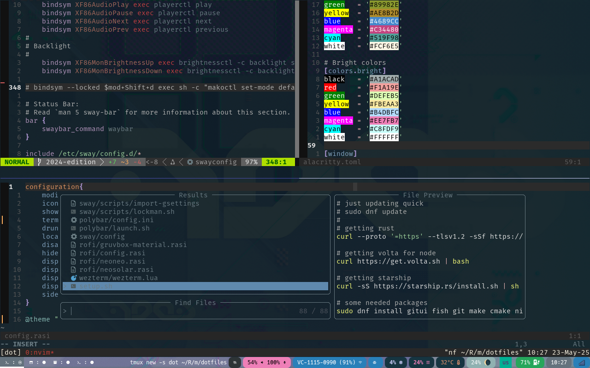

# Plamedi's dotfiles

## notes

To expedite new setups, I've created a setup.sh and dev\_env.sh
The setup should be run first. These do not assume a swaywm environment
and therefore do not setup for that.

Currently the setup assumes dnf as the package manager,
and will be adjusted in the future to include conditionals that check for the system package manager.

Besides that please read what is in the scripts first before running them, and decide for yourself what you want to keep or change.

Everything here is very experimental and may rely on manually building utilities
in order to work, approach with caution.

## Setup

On gnome the aesthetics are pretty toned down, with only neovim and alacritty being super showey.
One prime example is the tmux status line is practically stock now with a color change.
The screenshot above, shows the most bombastic case with swaywm running waybar,
which adds a splash of color to what is otherwise a pretty chill setup.

Anyway goodluck and thank you.
